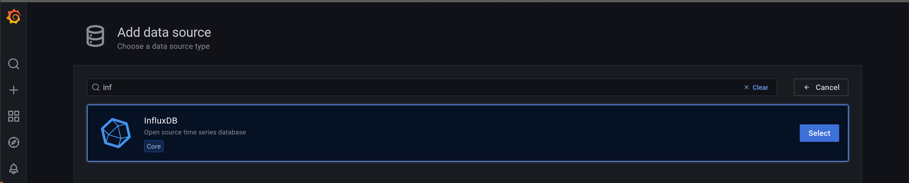
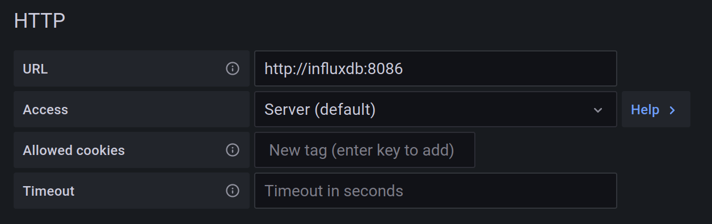
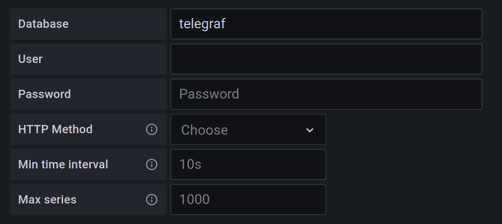

.. _graphical_monitoring:

Graphical Monitoring
====================

The library offers a graphical display of PSU outputs (**currently only TTI MX100TP-class and Keithley24X0-class**) using Eclipse-Mosquitto, Telegraf, InfluxDB and Grafana, all contained in Docker containers.

Prerequisites
-------------

To use the graphical monitoring, Docker and Docker-Compose need to be installed. For installation guides, see:

    * `Docker <https://docs.docker.com/engine/install/>`_
    * `Docker-Compose <https://docs.docker.com/compose/install/>`_

Setup
-----

Change into the ``monitoring`` directory and run docker-compose using the ``docker-compose.yml`` configuration file::

    cd monitoring
    docker-compose -f docker-compose.yml up -d

This will start Docker containers of Eeclipse-Mosquitto, Telegraf, IndluxDB and Grafana. The Grafana docker can be accessed in your browser under: ``http://localhost:3000``.

The data of InfluxDB and Grafana are stored in the docker volumes ``monitoring_influxdb-data`` and ``monitoring_grafana-data``. To stop the docker containers simmply run::

    docker-compose -f docker-compose.yml down

Once the containers are running, executing ``<device> monitor -m`` on the same machine should confirm the connection to the MQTT broker and will send the measurements to the InfluxDB database, from where they can be accessed with Grafana. For example::

    $ tti monitor -m ALL
    Connected to MQTT broker!
    # MONITORING_START 01/01/22
    # Time              Voltage1 (V)        Current1 (A)        Voltage2 (V)        Current2 (A)
    01/01/22 12:34:56   1.234               0.4567              -9.876              -4.321

This works with the default settings and if everything is run on the same machine. If the Docker containers run on a different machine, or if the measurements should be sent to your own MQTT broker, you can use the options

    * ``--broker`` to set the host address of the MQTT broker (the IP address where the Docker is running)
    * ``--port`` to set the port where the MQTT broker listens (usually 1883)
    * ``--username`` to set the username for broker authentification
    * ``--password`` to set the password for broker authentification.

Configuring Grafana
-------------------

To view the monitored data, you have to setup Grafana. Once the Dockers are running, go to ``http://localhost:3000`` in your browser. Login to Grafana using the default credentials

* Username: *admin*
* Password: *admin*

and set a new password on the next page.

Next you have to add InfluxDB as a data source. Select *Add your first data source*, and choose InfluxDB.

|

You have to set the *URL* to ``http://influxdb:8086``, which is the address of InfluxDB in the Docker network, and on the bootom of the page, set *Database* to ``telegraf``. Click *Save & test* and Grafana should tell you that the data source is working.

|

Now you can create a new dashboard and add a new panel with the data you want to display. The data is sent to InfluxDB in the `InfluxDB line protocol syntax <https://docs.influxdata.com/influxdb/v1.8/write_protocols/line_protocol_reference/>`_ as follows: ::

    <device name> <quantity>=<value>

The different quantities for the different devices are shown in the table_ below. The device name is derived from the VISA resource address. An instrument with VISA resource address ``ASRL/dev/ttyACM0::INSTR`` will have the device name ``ttyACM0``.

For example, if a TTi low voltage power supply is connected with VISA resource address ``ASRL/dev/ttyACM0::INSTR`` and you want to monitor the voltage of output 1 in a simple time series, you need to set the query of the panel to: ::

    SELECT last("voltage1") FROM "ttyACM0" WHERE $timeFilter GROUP BY time($__interval) fill(previous)

.. _table:

+----------------+------------------+----------------+---------------------------------+
| PSU class      | Quantity         | Unit           | description                     |
+================+==================+================+=================================+
| TTI MX100TP    | | voltage#       | V              | | voltage on the given channel  |
|                | | (# = 1, 2, 3)  |                | | e. g. voltage1 for channel 1  |
|                +------------------+----------------+---------------------------------+
|                | | current#       | A              | | current on the given channel  |
|                | | (# = 1, 2, 3)  |                | | e. g. current1 for channel 1  |
+----------------+------------------+----------------+---------------------------------+
| Keithley24X0   | voltage          | V              | measured output voltage         |
|                +------------------+----------------+---------------------------------+
|                | current          | A              | measured output current         |
|                +------------------+----------------+---------------------------------+
|                | resistance       | :math:`\Omega` | measured resistance             |
|                +------------------+----------------+---------------------------------+
|                | PSUTime          | s              | PSU timestamp                   |
|                +------------------+----------------+---------------------------------+
|                | statusRegister   |                | status information of the PSU   |
+----------------+------------------+----------------+---------------------------------+
